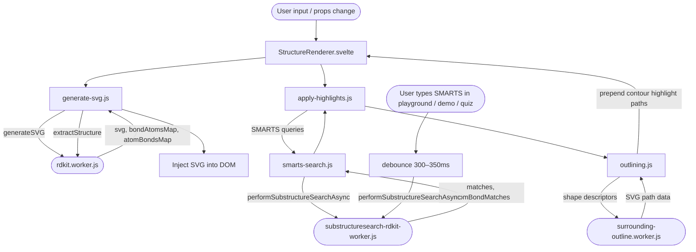

# Learn SMARTS

Website to help learn SMARTS

---

...

## Technical Overview

### Main Dependencies

| Package                            | Purpose                                                        |
| ---------------------------------- | -------------------------------------------------------------- |
| `rdkit`                            | RDKit WASM — molecule rendering and SMARTS substructure search |
| `paper`                            | Paper.js — vector graphics for highlight outline               |
| `sveltekit` + `svelte` v5          | Web framework                                                  |
| `tailwindcss` v4 + `shadcn-svelte` | Styling and headless UI primitives                             |

### RDKit Worker Architecture

The app runs three types of Web Workers, all managed through pool classes in `worker-manager.js` and `outlining.js`.

**Workers:**

- `rdkit.worker.js` — Renders molecule SVGs and extracts structure properties (canonical SMILES, formula, mass) using the RDKit WASM module
- `substructuresearch-rdkit-worker.js` — Performs SMARTS substructure searches, returning per-match atom and bond indices
- `surrounding-outline.worker.js` — Computes highlight outline paths using Paper.js (no RDKit dependency)

**Worker call flow:**

**Worker pools** (`worker-manager.js`):

- `renderPool` — 2 `rdkit.worker.js` instances, eagerly initialised on first use
- `searchPool` — 2 `substructuresearch-rdkit-worker.js` instances, lazily initialised
- Outline workers — 2 `surrounding-outline.worker.js` instances managed directly in `outlining.js`

All pools route messages to the least-busy worker and resolve results via `Promise`-based message passing with a 30-second timeout.
