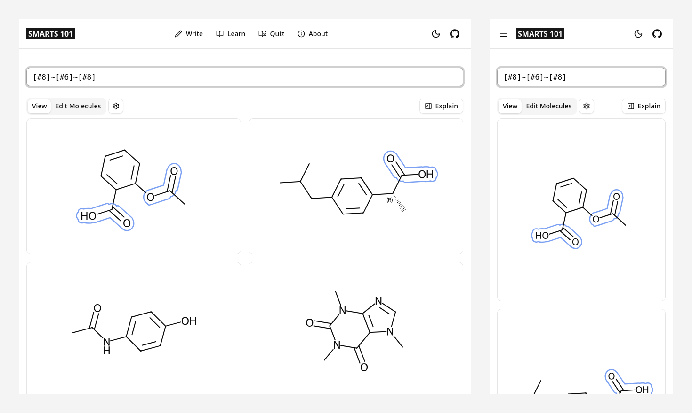

# SMARTS 101

> regex101.com for SMARTS — interactively build, test and debug substructure queries.

[](https://smarts101.charnley.fyi)

Static-file web application for interactively creating SMARTS queries and reactions, with live results.

## Features

- **Live matching** — write SMARTS patterns and see highlighted matches across multiple molecules in real-time
- **Reactions ** — query reactions with separate reactant/product highlights and per-fragment
- **SMARTS syntax explanation** — tree-sitter powered breakdown atom, bond, and recursive expression
- **Molecule examples** — druglike compounds, amino acids, peptides, RNA/DNA bases, ChEMBL, macrocycles examples
- and self-hostable (no backend, no data storage)

## Quick Start

```bash
git clone
make
make build-wasm
make dev PORT=5173
```

Open `http://localhost:5173/` and start typing SMARTS.

## Deploy

Build the static site, then serve with any web server

```bash
make build-wasm build
# output in build/
```

Or use `./docker/Dockerfile` to build and host the application.

## Dependencies

You need `emscripten` to compile the tree-sitter SMARTS grammar

```bash
# For debian-based
sudo apt install emscripten
```

## Technical Overview

| Package | Purpose |
|---|---|
| [rdkit](https://www.rdkit.org/) | RDKit WASM — molecule rendering and SMARTS substructure search |
| [paper.js](https://paperjs.org/) | Vector graphics for highlight outlines |
| [tree-sitter](https://tree-sitter.github.io/) | SMARTS grammar — powers the syntax explain panel |
| [codemirror](https://codemirror.net/) | Code editor with syntax highlighting and inline error markers |
| [sveltekit](https://svelte.dev/docs/kit) + [svelte](https://svelte.dev/) | Web framework, compiles to a static website |
| [tailwindcss](https://tailwindcss.com/) + [shadcn-svelte](https://shadcn-svelte.com/) + [lucide](https://lucide.dev/) | UI Components |
